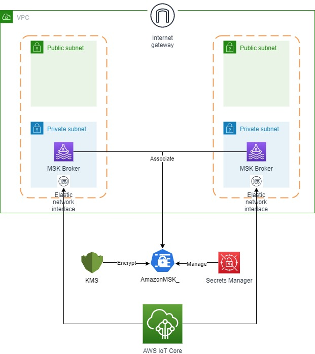

## Integrating AWS IoT Core rules with Amazon Managed Streaming for Apache Kafka (MSK)

This repository include sample CloudFormation templates demonstrating AWS IoT Core rule action integration with Amazon MSK.

For sake of completness, the root stack creates all required resources, such as: Amazon Virtual Private Cloud (Amazon VPC), Amazon MSK cluster, AWS IoT Core rule, AWS Secrets Manager, AWS Identity and Access Management (IAM).

To create all resources use the root.yaml template. It is possible to use each template seperatly, by inputing existing resources as parameters to the relevant template.

This example can be used as a starting point for production grade solution deployment.

### Architecture diagram

### Notes
The stack does not create the Amazon MSK topic itself. You will have to create the topic using standard tools.

You will have to attach your IoT Thing Certificate an appropriate policy allowing it to publish messages to the MQTT topic used by the AWS IoT Rule.

To test this stack you can use AWS IoT MQTT test from the console, and a Kafka consumer.

## Security

See [CONTRIBUTING](CONTRIBUTING.md#security-issue-notifications) for more information.

## License

This library is licensed under the MIT-0 License. See the LICENSE file.

